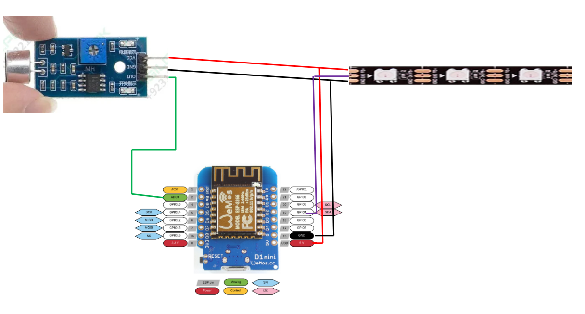

# CDS-2024
Campo di Specialità - Elettronico - Base Scout Bracciano

Asticella "Segna Fuoco"

Il progetto propone la realizzazione di una bacchetta luminosta che si illunina sulla base dell'intensità della Voce, vuole essere un indicatore sull'intensità delle attività durante il Fuoco Serale.

